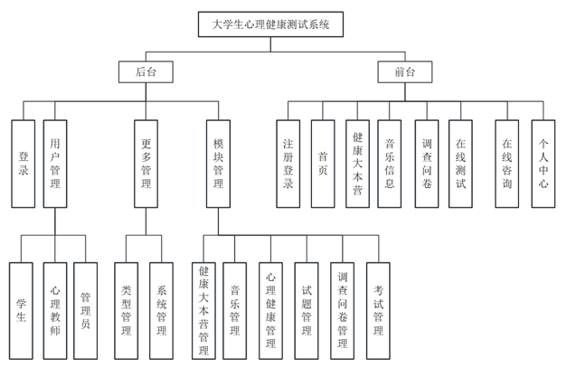
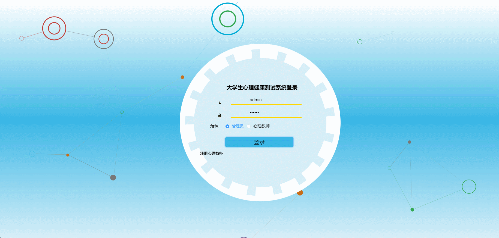
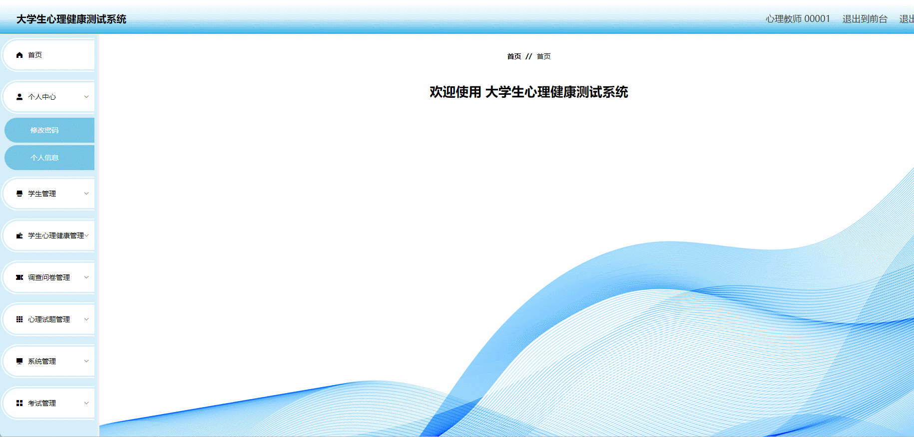

# student-mental-health🎂

基于SpringBoot+Vue的大学生心理健康测试系统

## 介绍🌞

> 该系统结合了前后端技术，通过Web应用的形式为大学生提供了方便快捷的心理健康测试和咨询服务。系统功能设计采取MySQL作为后台数据的主要存储单元，采用SpringBoot框架进行系统的开发，前端采用Vue与后端不分离。本系统的实现有助于提升大学生的心理健康意识，促进心理健康教育与干预，为个体和社会心理健康发展做出积极贡献。

## 软件架构🌞




## 项目演示🌞

**学生用户**


**管理端**



**心理老师端**




## 安装教程🌞

```
1. 运行环境准备mysql8 + java8 + node14.16.1

2. 配置maven路径，加载依赖

3. 运行sql文件，确保application.yml或config.properties的数据库名称和账号密码是数据库所在主机的账号密码
```


## 使用说明🌞

```
1. 登入

		管理员账号：admin 密码：123456

		学生账号：600001 密码：123456

		学生账号：600001 密码：123456
  
2. 运行流程

SpringBoot+Vue项目的部署详情可以查看这篇CSDN博客：http://t.csdnimg.cn/kpuxS

前后端不分离项目的部署流程可以查看这篇CSDN博客：http://t.csdnimg.cn/CslA5
```


## CSDN项目合集🌞

点击前往：http://t.csdnimg.cn/Q4u84


## 联系我🌞

**有偿获取完整源码或调试代码**

🐧：1902317191
wx：coding1902317191
